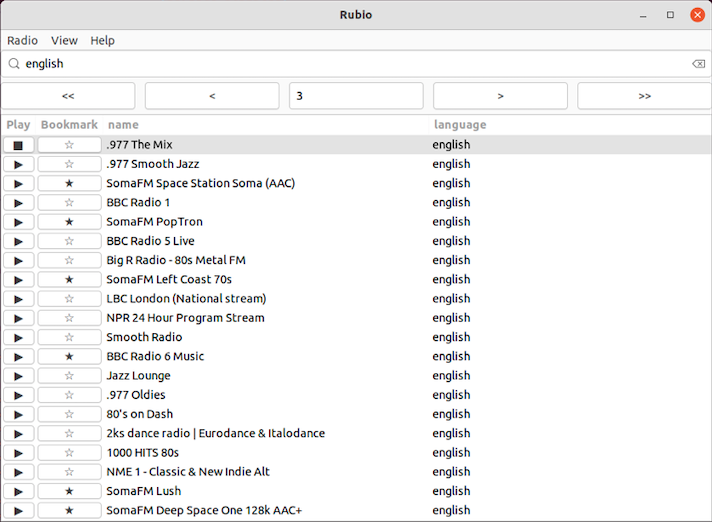
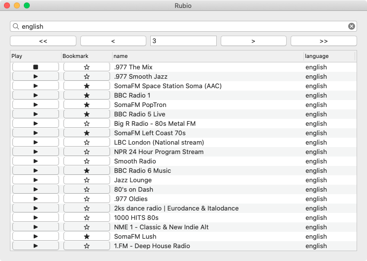
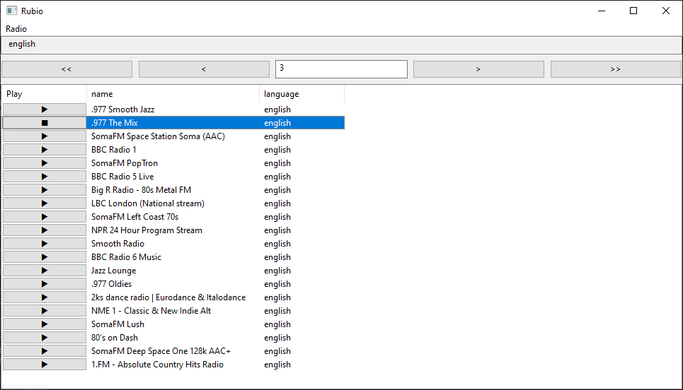
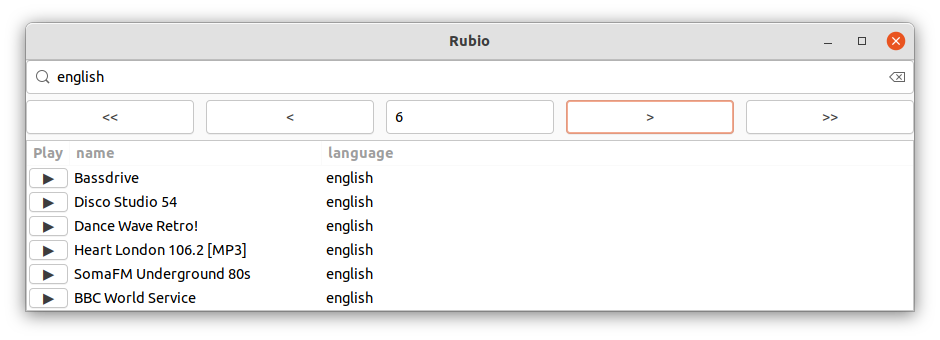

# rubio-radio
[](https://badge.fury.io/rb/rubio-radio)

Linux



Mac



Windows



:bowtie: Alpha

## Installation

### Requirements:

**[VLC](https://github.com/videolan/vlc)**

`rubio` uses the `vlc -I dummy` as the audio playback backend.

On Mac, it is recommended that you install VLC via [Homebrew](https://brew.sh/) to ensure the `vlc` command is added to the PATH environment variable automatically:

```
brew install vlc
```

On Windows, install VLC using the [Windows installer](https://www.videolan.org/vlc/download-windows.html), and then add the installed VLC app directory to the PATH environment variable (e.g. `C:\Program Files (x86)\VideoLAN\VLC`) to make the `vlc` command available.

### Ruby Gem:

```
gem install rubio-radio
```

## Usage

Run with this command:

```
rubio
```

The top 10,000 [Radio Browser](https://www.radio-browser.info/) stations are displayed by default. But, you can customize the count (note that currently, there are only about 32,000 [Radio Browser](https://www.radio-browser.info/) stations total).

```
rubio --count 20000
```

Default player is `vlc -I dummy`. But, you can use any command line player that can take URL of radio station as its first argument.

```
rubio --backend mpg123
```

Learn more about `rubio` options:

```
rubio --help
```

```
Usage: rubio [options]
        --vlc
        --mpg123
        --backend CMD
        --count RADIO_STATION_COUNT
        --per-page ROWS_PER_PAGE
        --width WINDOW_WIDTH
        --height WINDOW_HEIGHT
        --debug
        --no-menu
        --help
        --version
```

Examples:

```
rubio --vlc              # `vlc -I rc` (interactive command line interface)
rubio --mpg123           # `rubio --backend mpg123`
rubio --count 1000       # Displays the top 1,000 Radio Browser stations
```

Small Screen Example:

```
rubio --per-page 6 --no-menu
```



## Links

* [Ruby](https://github.com/ruby/ruby)
  * spawn
* [Radio Browser](https://www.radio-browser.info/)
  * [Radio Browser API](https://de1.api.radio-browser.info/)
* [Glimmer DSL for LibUI](https://github.com/AndyObtiva/glimmer-dsl-libui)

## Change Log

[CHANGELOG.md](CHANGELOG.md)

## LICENSE

[MIT](LICENSE.txt)
